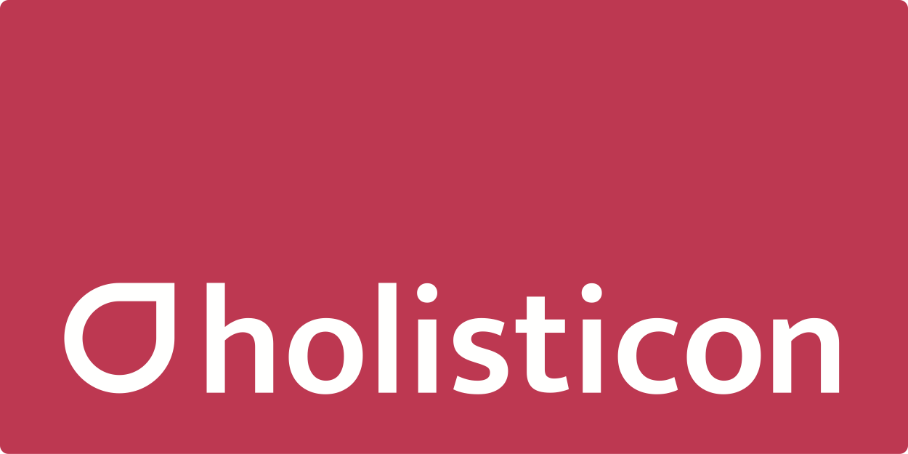

Elbsides is North Germany's annual computer security conference
organized by the community for the
community. We will be welcoming you back in 2023 for an Elbsides Light! (If you are looking
for information of the 2019 Elbsides conference, see the
[2019 Elbsides conference site](https://2019.elbsides.de).)
      
Follow us at [@elbsides](https://twitter.com/elbsides) for updates!

## [Sponsors](https://2019.elbsides.de/sponsors.html) ##

Such an event cannot be organized without the support of the community
as the admission fee is merely a token amount, so we cannot thank our
sponsors enough in making this event possible. In 2019, we had the
following sponsors, and we hope to see them back on board for 2023 and the next main event in 2024!

<table>
		<tr>
			<td style="background-color: white; border: 5px solid #00d298; text-align: center; min-width:200px;">
				
			</td>
			<td style="background-color: white; border: 5px solid #00d298; text-align: center; min-width:200px">
				
			</td>
			<td style="background-color: white; border: 5px solid #00d298; text-align: center; min-width:200px">
				
			</td>
		</tr>
		<tr>
			<td style="background-color: white; border: 5px solid #00d298; text-align: center; min-width:200px;">
				
			</td>
			<td style="background-color: white; border: 5px solid #00d298; text-align: center; min-width:200px;">
				
			</td>
			<td style="background-color: white; border: 5px solid #00d298; text-align: center; min-width:200px">
				
			</td>
		</tr>
		<tr>
			<td style="background-color: white; border: 5px solid #00d298; text-align: center; min-width:200px;">
				
			</td>
			<td style="background-color: white; border: 5px solid #00d298; text-align: center; min-width:200px">
				
			</td>
			<td style="background-color: white; border: 5px solid #00d298; text-align: center; min-width:200px;">
				
			</td>
		</tr>
		<tr>
			<td style="background-color: white; border: 5px solid #00d298; text-align: center; min-width:200px;">
				
			</td>
			<td style="background-color: white; border: 5px solid #00d298; text-align: center; min-width:200px;">
				
			</td>
			<td style="background-color: white; border: 5px solid #00d298; text-align: center; min-width:200px;">
				
			</td>
		</tr>
		<tr>
			<td style="background-color: white; border: 5px solid #00d298; text-align: center; min-width:200px; height:120px">
				
			</td>
			<td style="background-color: white; border: 5px solid #00d298; text-align: center; min-width:200px; height:120px">
				
			</td>
			<td style="background-color: white; border: 5px solid #00d298; text-align: center; min-width:200px; height:120px">
				
			</td>
		</tr>
		<tr>
			<td style="background-color: white; border: 5px solid #00d298; text-align: center; min-width:200px; height:120px">
				
			</td>
			<td style="background-color: white; border: 5px solid #00d298; text-align: center; min-width:200px; height:120px">
				
			</td>
		</tr>
</table>
	
In 2019 we were sponsored by [DFN-CERT](https://www.dfn-cert.de),
[Schutzwerk GmbH ](https://www.schutzwerk.com),
[ Hamburg Port Authority ](https://www.hamburg-port-authority.de),
[Holisticon AG](https://www.holisticon.de),
[PRESENSE Technologies GmbH](https://www.pre-sense.de),
[Codemetrix GmbH](https://www.codemetrix.io),
[sum.cumo GmbH](https://www.sumcumo.com),
[Graylog](https://www.graylog.org),
[Superluminar](https://superluminar.io),
[Deloitte](http://www.deloitte.com/de),
[Lotto24](https://lotto24.de),
[Yubico AB](https://www.yubico.com),
[Allgeier CORE GmbH](https://www.allgeier-core.com),
[Airbus S.A.S.](https://www.airbus.com),
[Google LLC](https://www.google.com),
[HERE Global B.V.](https://www.here.com),
[BSidesMunich](https://www.bsidesmunich.org) and [Detlev Louis Motorrad-Vertriebsgesellschaft mbH](https://www.louis.eu). See
the [2019 sponsor page](https://2019.elbsides.de/sponsors.html) for more details.

